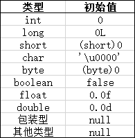

# 类加载过程代码篇
> 本文理论较少主要是以代码方式来说明类加载过程，其中一些步骤我暂时无法用代码演示出来比如验证步骤等，请谅解。<br/>
> 理论篇请移步 [JavaGuide类的生命周期](https://snailclimb.gitee.io/javaguide/#/docs/java/jvm/%E7%B1%BB%E5%8A%A0%E8%BD%BD%E8%BF%87%E7%A8%8B)

## 静态语句块、语句块、构造方法 加载顺序

### 代码

```
public class InitOrder {

    static {
        System.out.println("----------------------静态语句块------------------");
        System.out.println("----------------------静态语句块------------------");
    }
    
    {
        System.out.println("----------------------语句块------------------");
        System.out.println("----------------------语句块------------------");
    }
    
    public InitOrder(){
        System.out.println("----------------------构造方法------------------");
        System.out.println("----------------------构造方法------------------");
    }

    public static void main(String[] args) {
        new InitOrder();
    }
}
```
**猜下运行结果**<br/><br/><br/><br/><br/><br/>

### 运行结果

----------------------静态语句块------------------
----------------------静态语句块------------------
----------------------语句块------------------
----------------------语句块------------------
----------------------构造方法------------------
----------------------构造方法------------------

### 加载顺序
根据运行结果可以看出加载顺序为 静态语句块>语句块>构造方法

## 含父类的 静态语句块、语句块、构造方法 加载顺序

### 代码

```
public class InitOrderParent {

    static {
        System.out.println("----------------------父类静态语句块------------------");
        System.out.println("----------------------父类静态语句块------------------");
    }

    {
        System.out.println("----------------------父类语句块------------------");
        System.out.println("----------------------父类语句块------------------");
    }

    public InitOrderParent(){
        System.out.println("----------------------父类构造方法------------------");
        System.out.println("----------------------父类构造方法------------------");
    }

}

public class InitOrder extends InitOrderParent {

    static {
        System.out.println("----------------------静态语句块------------------");
        System.out.println("----------------------静态语句块------------------");
    }

    {
        System.out.println("----------------------语句块------------------");
        System.out.println("----------------------语句块------------------");
    }

    public InitOrder(){
        System.out.println("----------------------构造方法------------------");
        System.out.println("----------------------构造方法------------------");
    }

    public static void main(String[] args) {
        new InitOrder();
    }
}
```
**猜下运行结果**<br/><br/><br/><br/><br/><br/>

### 运行结果
----------------------父类静态语句块------------------
----------------------父类静态语句块------------------
----------------------静态语句块------------------
----------------------静态语句块------------------
----------------------父类语句块------------------
----------------------父类语句块------------------
----------------------父类构造方法------------------
----------------------父类构造方法------------------
----------------------语句块------------------
----------------------语句块------------------
----------------------构造方法------------------
----------------------构造方法------------------

### 加载顺序

我们可以把加载顺序看成两层：静态层、非静态层。那么加载顺序看图↓↓↓<br/>


## 静态变量 如果创建本类 那加载又是什么样的？

> <span id="variable" >小知识</span>： <br/>
> 变量（非final）在类加载过程中分为两步
>> 第一步：创建这个变量并对变量赋初始值，看下图（初始值图）<br/>
>> 第二步：对变量赋代码中写的默认值

初始值图：<br/>


### 代码

```
public class InitOrder {

    //计数器：统计被 加载 的次数
    private static final List countNew = new ArrayList();

    static InitOrder initOrder = new InitOrder("static变量引起的new");

    static {
        System.out.println("----------------------静态语句块------------------");
        System.out.println("----------------------静态语句块------------------");
    }

    {
        System.out.println("----------------------语句块------------------");
        countNew.add(1);
        System.out.println("InitOrder 被第"+countNew.size()+"次加载");
        System.out.println("----------------------语句块------------------");
    }

    public InitOrder(String flag){
        System.out.println("----------------------构造方法------------------");
        System.out.println("InitOrder 被第"+countNew.size()+"次加载");
        System.out.println("flag："+flag);
        System.out.println("----------------------构造方法------------------");
    }

    public static void main(String[] args) {
        new InitOrder("main方法引起的new");
    }
}
```
**猜下运行结果**<br/><br/><br/><br/><br/><br/>

### 运行结果
----------------------语句块------------------
InitOrder 被第1次加载
----------------------语句块------------------
----------------------构造方法------------------
InitOrder 被第1次加载
flag：static变量引起的new
----------------------构造方法------------------
----------------------静态语句块------------------
----------------------静态语句块------------------
----------------------语句块------------------
InitOrder 被第2次加载
----------------------语句块------------------
----------------------构造方法------------------
InitOrder 被第2次加载
flag：main方法引起的new
----------------------构造方法------------------

### 分析

可以看到静态语句块的加载靠后了，这是因为静态变量中创建了InitOrder 这是 InitOrder的第一次创建 。

### 需要注意的坑

#### 代码

```

public class InitOrder {

    //计数器：统计被 加载 的次数
    private static final List countNew = new ArrayList();

    static InitOrder initOrder = new InitOrder("static变量引起的new");

	//新增代码 注意位置
    static Map map = new HashMap();

    static {
        System.out.println("----------------------静态语句块------------------");
        System.out.println("----------------------静态语句块------------------");
    }

    {
        System.out.println("----------------------语句块------------------");
        countNew.add(1);
        System.out.println("InitOrder 被第"+countNew.size()+"次加载");
        System.out.println("----------------------语句块------------------");
    }

    public InitOrder(String flag){
        System.out.println("----------------------构造方法------------------");
        System.out.println("InitOrder 被第"+countNew.size()+"次加载");
        System.out.println("flag："+flag);
		//新增代码
        System.out.println("map is "+(map == null ? "null" : "not null"));
		//新增代码
        map.put(1,1);
        System.out.println("----------------------构造方法------------------");
    }

    public static void main(String[] args) {
        new InitOrder("main方法引起的new");
    }
```

**猜下运行结果**<br/><br/><br/><br/><br/><br/>

他报错了，没想到吧（手动滑稽）。

#### 运行结果
----------------------语句块------------------
InitOrder 被第1次加载
----------------------语句块------------------
----------------------构造方法------------------
InitOrder 被第1次加载
flag：static变量引起的new
map is null
java.lang.ExceptionInInitializerError
Caused by: java.lang.NullPointerException

#### 分析原因
由打印信息我们可以看到 InitOrder 第一次加载的时候就报错了（静态变量initOrder的赋值操作），这是因为非final变量在创建与赋值变量是分开的，而且这个变量赋值操作是从上到下的（先给initOrder赋值，再给map赋值），所有在给initOrder赋值时 map 为空（不明白为啥是空的,多看看上边的[小知识](#variable)）。

#### 解决办法1：静态变量上移

##### 代码

```
public class InitOrder {

    //计数器：统计被 加载 的次数
    private static final List countNew = new ArrayList();
	//注意位置
    static Map map = new HashMap();

    static InitOrder initOrder = new InitOrder("static变量引起的new");

    static {
        System.out.println("----------------------静态语句块------------------");
        System.out.println("----------------------静态语句块------------------");
    }

    {
        System.out.println("----------------------语句块------------------");
        countNew.add(1);
        System.out.println("InitOrder 被第"+countNew.size()+"次加载");
        System.out.println("----------------------语句块------------------");
    }

    public InitOrder(String flag){
        System.out.println("----------------------构造方法------------------");
        System.out.println("InitOrder 被第"+countNew.size()+"次加载");
        System.out.println("flag:"+flag);
        System.out.println("map is "+(map == null ? "null" : "not null"));
        map.put(1,1);
        System.out.println("----------------------构造方法------------------");
    }

    public static void main(String[] args) {
        new InitOrder("main方法引起的new");
    }
}
```

##### 运行结果
----------------------语句块------------------
InitOrder 被第1次加载
----------------------语句块------------------
----------------------构造方法------------------
InitOrder 被第1次加载
flag:static变量引起的new
map is not null
----------------------构造方法------------------
----------------------静态语句块------------------
----------------------静态语句块------------------
----------------------语句块------------------
InitOrder 被第2次加载
----------------------语句块------------------
----------------------构造方法------------------
InitOrder 被第2次加载
flag:main方法引起的new
map is not null
----------------------构造方法------------------


#### 解决办法2：放在静态语句块

##### 代码

```
public class InitOrder {

    //计数器：统计被 加载 的次数
    private static final List countNew = new ArrayList();

    static InitOrder initOrder = new InitOrder("static变量引起的new");
	//注意位置
    static Map map = new HashMap();

    static {
        System.out.println("----------------------静态语句块------------------");
		//代码调整
        System.out.println("map is "+(map == null ? "null" : "not null"));
        //代码调整
		map.put(1,1);
        System.out.println("----------------------静态语句块------------------");
    }

    {
        System.out.println("----------------------语句块------------------");
        countNew.add(1);
        System.out.println("InitOrder 被第"+countNew.size()+"次加载");
        System.out.println("----------------------语句块------------------");
    }

    public InitOrder(String flag){
        System.out.println("----------------------构造方法------------------");
        System.out.println("InitOrder 被第"+countNew.size()+"次加载");
        System.out.println("flag:"+flag);
        System.out.println("----------------------构造方法------------------");
    }

    public static void main(String[] args) {
        new InitOrder("main方法引起的new");
    }
}
```

##### 运行结果

----------------------语句块------------------
InitOrder 被第1次加载
----------------------语句块------------------
----------------------构造方法------------------
InitOrder 被第1次加载
flag:static变量引起的new
----------------------构造方法------------------
----------------------静态语句块------------------
map is not null
----------------------静态语句块------------------
----------------------语句块------------------
InitOrder 被第2次加载
----------------------语句块------------------
----------------------构造方法------------------
InitOrder 被第2次加载
flag:main方法引起的new
----------------------构造方法------------------

## final 变量

有时间了整理，这块会涉及到字节码（javap -v 类名），因为经运行发现非包装型的基本类型赋值 与 包装型赋值流程还不一样，看下代码吧（其中原理还没整明白，这是遗留问题）

### 代码
```
public class InitOrder {

    static InitOrder initOrder = new InitOrder("static变量引起的new");

    final static int num = 10;

    final static Map map = new HashMap();


    public InitOrder(String flag){
        System.out.println("----------------------构造方法------------------");
        System.out.println("flag:"+flag);
        System.out.println("num:"+num);
        System.out.println("map is "+(map == null ? "null" : "not null"));
        map.put(1,1);
        System.out.println("----------------------构造方法------------------");
    }

    public static void main(String[] args) {
        new InitOrder("main方法引起的new");
    }
}
```

### 运行结果

----------------------构造方法------------------
flag:static变量引起的new
num:10
map is null
java.lang.ExceptionInInitializerError
Caused by: java.lang.NullPointerException


### 我以为
我以为不会报错
我以为map已经赋值
我以为 num 有值了 map 也就有值了
原理我以为只是我以为