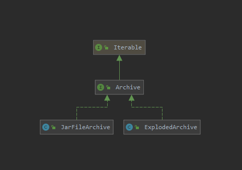

# spring-boot启动过程(源码分析) #
> 参考文章：
>
1. http://www.iocoder.cn/Spring-Boot/jar/?self

##代码来源
文章中代码均来源于 [spring-boot 开源库](https://github.com/spring-projects/spring-boot) ，git版本号：9ee2487

## 优先阅读
- [spring-boot启动过程（简单分析）](./spring-boot启动过程（简单分析）.md)

##类结构分析
### 涉及到的类以及类图
1. 启动器: org.springframework.boot.loader.Launcher
	
	

	1. **jar包启动类**（重点类）： org.springframework.boot.loader.JarLauncher
	2. **档案创建类**（重点类,**大部分实现在这个类**）： org.springframework.boot.loader.ExecutableArchiveLauncher
	3. war包启动类： org.springframework.boot.loader.WarLauncher
2. 档案: org.springframework.boot.loader.archive.Archive

	

	1. **jar档案类**（重点类）： org.springframework.boot.loader.archive.JarFileArchive
	2. 目录档案类： org.springframework.boot.loader.archive.ExplodedArchive

### 启动器类与档案类的关系

> jar包启动时创建 JarLauncher 对象（通过无参构造创建）；由于创建 JarLauncher ，所以会调用 ExecutableArchiveLauncher 的无参构造（类加载导致），此构造方法中生成了运行jar包的 Archive ；同时通过 JarLauncher 调用了  Launcher#launch 方法，其中生成了嵌套jar包的 Archive 。

### 相关代码
1. JarLauncher#main 内

	```
	public static void main(String[] args) throws Exception {
		new JarLauncher().launch(args);
	}
	```
2. ExecutableArchiveLauncher 无参构造

	```
	public ExecutableArchiveLauncher() {
		...
		//生成运行jar包的 Archive
		this.archive = createArchive();
		...
	}
	```
3.  Launcher#launch 方法。 ExecutableArchiveLauncher、JarLauncher 均未重写 launch 方法，所以调用 Launcher的launch 方法
	```
	protected void launch(String[] args) throws Exception {
		
		//其中getClassPathArchivesIterator 方法创建了 嵌套jar包的 Archive 并返回了 迭代器
		ClassLoader classLoader = createClassLoader(getClassPathArchivesIterator());
		...
	}
		
	```