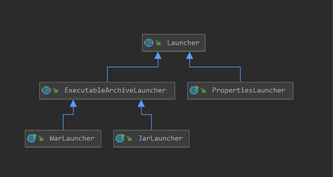
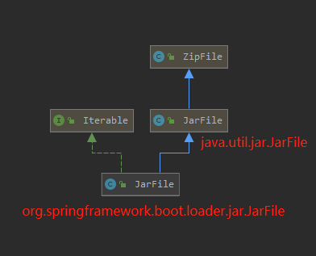

# spring-boot启动过程(源码分析) #

> 说明：
>> 以下均已 jar包 运行方式分析

> 参考文章：
>> 芋道源码: http://www.iocoder.cn/Spring-Boot/jar/?self


## 代码来源
文章中代码均来源于 [spring-boot 开源库](https://github.com/spring-projects/spring-boot) 

spring-boot版本号：v2.4.0-M2

git版本号：e6ee3c1

## 优先阅读
- [spring-boot启动过程（简单分析）](./spring-boot启动过程（简单分析）.md)


## 类结构分析

### 涉及到的类以及类图
1. 启动器: org.springframework.boot.loader.Launcher
	
	

	1. **jar包启动类**（重点类）： org.springframework.boot.loader.JarLauncher
	2. **档案创建类**（重点类,**大部分实现在这个类**）： org.springframework.boot.loader.ExecutableArchiveLauncher
	3. war包启动类： org.springframework.boot.loader.WarLauncher
2. 档案: org.springframework.boot.loader.archive.Archive

	

	1. **jar档案类**（重点类,存储jar包的信息）： org.springframework.boot.loader.archive.JarFileArchive
	2. 目录档案类： org.springframework.boot.loader.archive.ExplodedArchive

### 启动器类与档案类的关系

> jar包启动时创建 JarLauncher 对象（通过无参构造创建）并调用launch方法；由于创建 JarLauncher ，所以会调用 ExecutableArchiveLauncher 的无参构造（类加载导致），此构造方法中生成了运行jar包的 Archive ；然后通过 JarLauncher 调用了  Launcher#launch 方法，其中生成了嵌套jar包的 Archive 。

### 相关代码
1. JarLauncher#main 内

	```
	public static void main(String[] args) throws Exception {
		new JarLauncher().launch(args);
	}
	```
2. ExecutableArchiveLauncher 无参构造

	```
	public ExecutableArchiveLauncher() {
		...
		//生成运行jar包的 Archive
		this.archive = createArchive();
		...
	}
	```
3.  Launcher#launch 方法。 ExecutableArchiveLauncher、JarLauncher 均未重写 launch 方法，所以调用 Launcher的launch 方法
	```
	protected void launch(String[] args) throws Exception {
		
		//其中getClassPathArchivesIterator 方法创建了 嵌套jar包的 Archive 并返回了 迭代器
		ClassLoader classLoader = createClassLoader(getClassPathArchivesIterator());
		...
	}
		
	```

## new JarLauncher() 源码分析
1. JarLauncher 无参构造
	```
	public class JarLauncher extends ExecutableArchiveLauncher {
		...
		public JarLauncher() {
			//隐式调用父类的无参构造,下边这行是我写上的源码中没有。
			super();
		}
		...
	}
	```
2. ExecutableArchiveLauncher 无参构造
	```
	public abstract class ExecutableArchiveLauncher extends Launcher {
		...
		public ExecutableArchiveLauncher() {
			try {
				//生成运行jar包的 Archive
				this.archive = createArchive();
				//获取jar包中扩展包的索引文件（使用官方推荐的docker打包方式会用到这个索引文件），此处忽略不再赘述
				this.classPathIndex = getClassPathIndex(this.archive);
			}
			catch (Exception ex) {
				throw new IllegalStateException(ex);
			}
		}
		...
	}
	```
	1. ExecutableArchiveLauncher未重写 createArchive 方法，所以调用 Launcher#createArchive 方法
		```
		public abstract class Launcher {
			...
			protected final Archive createArchive() throws Exception {
				ProtectionDomain protectionDomain = getClass().getProtectionDomain();
				CodeSource codeSource = protectionDomain.getCodeSource();
				URI location = (codeSource != null) ? codeSource.getLocation().toURI() : null;
				String path = (location != null) ? location.getSchemeSpecificPart() : null;
				if (path == null) {
					throw new IllegalStateException("Unable to determine code source archive");
				}
				//以上几行为获取到运行程序根路径
				File root = new File(path);
				if (!root.exists()) {
					throw new IllegalStateException("Unable to determine code source archive from " + root);
				}
				//目录（war包 或者 官方推荐的docker打包方式）创建 ExplodedArchive ; jar包创建 JarFileArchive
				return (root.isDirectory() ? new ExplodedArchive(root) : new JarFileArchive(root));
			}
			...
		}
		```
		1. JarFileArchive#JarFileArchive(java.io.File) 构造方法
			```
			public class JarFileArchive implements Archive {
				...

				//jar文件对应的对象
				private final JarFile jarFile;
				//jar文件的绝对路径
				private URL url;

				public JarFileArchive(File file) throws IOException {
					this(file, file.toURI().toURL());
				}
			
				public JarFileArchive(File file, URL url) throws IOException {
					//这里创建了 jarFile对象
					this(new JarFile(file));
					this.url = url;
				}
			
				public JarFileArchive(JarFile jarFile) {
					this.jarFile = jarFile;
				}
				...
			}
			```
			1. [JarFile存储了jar包的所有内容，具体得展开讲，可以先跳过](#JarFile)

## Launcher#launch 方法源码分析
持续酝酿中...

## <span id="JarFile">【可选】</span> org.springframework.boot.loader.jar.JarFile#JarFile(java.io.File) 构造方法
### 此 JarFile 非彼 JarFile
org.springframework.boot.loader.jar.JarFile 继承了 java.util.jar.JarFile
上图



持续酝酿中...

## 扩展资料

### 官方推荐的dockerFile
[官方2.4.0-M2文档](https://docs.spring.io/spring-boot/docs/2.4.0-M2/reference/pdf/spring-boot-reference.pdf)
```
FROM adoptopenjdk:11-jre-hotspot as builder
WORKDIR application
ARG JAR_FILE=target/*.jar
COPY ${JAR_FILE} application.jar
RUN java -D jarmode=layertools -jar application.jar extract
FROM adoptopenjdk:11-jre-hotspot
WORKDIR application
COPY --from=builder application/dependencies/ ./
COPY --from=builder application/spring-boot-loader/ ./
COPY --from=builder application/snapshot-dependencies/ ./
COPY --from=builder application/application/ ./
ENTRYPOINT ["java", "org.springframework.boot.loader.JarLauncher"]
```
值得注意的是 jarmode=layertools 他会进行jar包的分层。
#### 具体怎么分层又怎么启动，感兴趣的话可再深入学习以下代码（此处只作为敲门砖）
1. 第一块
	```
	public abstract class Launcher {
		...
		protected final Archive createArchive() throws Exception {
			...
			//这里创建ExplodedArchive对象
			return (root.isDirectory() ? new ExplodedArchive(root) : new JarFileArchive(root));
		}
		...
	}
	```
2. 第二块
	```
	public abstract class ExecutableArchiveLauncher extends Launcher {
		...
		public ExecutableArchiveLauncher() {
			try {
				//这里 去查看对应 JarLauncher#getClassPathIndex 的重写
				this.classPathIndex = getClassPathIndex(this.archive);
			}
			catch (Exception ex) {
				throw new IllegalStateException(ex);
			}
		}
		...
	}
	```
2. 	第三块
	```
	public abstract class Launcher {

		private static final String JAR_MODE_LAUNCHER = "org.springframework.boot.loader.jarmode.JarModeLauncher";
	
		protected void launch(String[] args) throws Exception {
			//获取系统参数 即 dockerFile 中的 -Djarmode=layertools
			String jarMode = System.getProperty("jarmode");
			//获取启动类 对应启动类就是 Launcher.JAR_MODE_LAUNCHER
			String launchClass = (jarMode != null && !jarMode.isEmpty()) ? JAR_MODE_LAUNCHER : getMainClass();
			//启动启动类
			launch(args, launchClass, classLoader);
		}
	}
	```
3. 	第四块：看JarModeLauncher源码去吧！
	