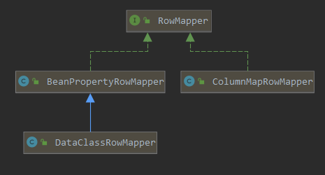

# jdbcTemplate 使用

----------

## 什么是JdbcTemplate
JdbcTemplate 是spring对jdbc的封装，简化了jdbc的繁琐操作。

## 依赖包
1. 使用mysql数据库
2. Druid框架作为连接池

具体依赖包

```
<!-- jdbc -->
<dependency>
    <groupId>org.springframework</groupId>
    <artifactId>spring-jdbc</artifactId>
    <version>${spring.version}</version>
</dependency>

<!-- mysql -->
<dependency>
    <groupId>mysql</groupId>
    <artifactId>mysql-connector-java</artifactId>
    <version>${mysql.version}</version>
</dependency>

<!-- druid -->
<dependency>
    <groupId>com.alibaba</groupId>
    <artifactId>druid</artifactId>
    <version>${druid.version}</version>
</dependency>

<dependency>
	<groupId>org.springframework</groupId>
	<artifactId>spring-beans</artifactId>
	<version>${spring.version}</version>
</dependency>
<dependency>
	<groupId>org.springframework</groupId>
	<artifactId>spring-core</artifactId>
	<version>${spring.version}</version>
</dependency>
<dependency>
	<groupId>org.springframework</groupId>
	<artifactId>spring-context</artifactId>
	<version>${spring.version}</version>
</dependency>
<dependency>
	<groupId>org.springframework</groupId>
	<artifactId>spring-expression</artifactId>
	<version>${spring.version}</version>
</dependency>
```

## spring-jdbc 与 spring-orm 的区别

- spring-jdbc是纯jdbc的封装
- spring-orm是制定了规则，供第三方持久化框架集成到spring。例如jpa、hibernate

## 配置Druid连接池

```
@Bean("druidDataSource")
public DruidDataSource dataSource(){
    DruidDataSource druidDataSource = new DruidDataSource();
    //设置数据库类型
    druidDataSource.setDbType("mysql");
    //设置数据库驱动
    druidDataSource.setDriverClassName("com.mysql.jdbc.Driver");
    //设置数据地址
    druidDataSource.setUrl("jdbc:mysql://192.168.123.222/jdbc_test?characterEncoding=utf8&allowMultiQueries=true");
    //数据库账号
    druidDataSource.setUsername("jdbc");
    //数据库密码
    druidDataSource.setPassword("jdbc");
    return druidDataSource;
}
```

**@Bean注解是创建一个Bean,相当于xml的bean标签**

## 配置JdbcTemplate

```
@Bean
public JdbcTemplate jdbcTemplate(@Qualifier("druidDataSource")DataSource dataSource){
    JdbcTemplate jdbcTemplate = new JdbcTemplate();
    //添加数据源
    jdbcTemplate.setDataSource(dataSource);
    return jdbcTemplate;
}
```

## 使用JdbcTemplate进行增删改

### 添加

```
public int insert(Book book) {
    //? 是占位符
    String sql = "insert into book(b_name,price) values(?,?)";
    return jdbcTemplate.update(sql, book.getbName(), book.getPrice());
}
```

### 添加后返回id

```
public Long insertBackId(Book book) {
    String sql = "insert into book(b_name,price) values(?,?)";

    PreparedStatementCreator preparedStatementCreator = con -> {
        //Statement.RETURN_GENERATED_KEYS 标识返回 id
        PreparedStatement preparedStatement = con.prepareStatement(sql, Statement.RETURN_GENERATED_KEYS);
        //设置占位符对应的值
        preparedStatement.setString(1,book.getbName());
        preparedStatement.setString(2,book.getPrice());
        return preparedStatement;
    };

    KeyHolder keyHolder = new GeneratedKeyHolder();
    int row = jdbcTemplate.update(preparedStatementCreator,keyHolder);
    if (row > 0) {
        //返回的id
        return keyHolder.getKey().longValue();
    } else {
        return null;
    }
}
```

### 修改

```
public int update(Book book) {
    String sql = "update book set b_name=?,price=? where id=?";
    return jdbcTemplate.update(sql, book.getbName(), book.getPrice(),book.getId());
}
```

### 删除

```
public int delete(Long id) {
    String sql = "delete from book where id=?";
    return jdbcTemplate.update(sql, id);
}
```

### [示例项目](./spring-framework-demo/JdbcTemplate-CUD)

## 查询

### 查询返回值

```
public Integer selectCount() {
    //统计行数
    String sql = "select count(1) from book";
    //查询返回值
    return jdbcTemplate.queryForObject(sql,Integer.class);
}
```

### 查询返回对象

```
public Book selectById(Long id) {
    //根据id查询 sql
    String sql = "select * from book where id = ?";
    //查询返回对象
    return jdbcTemplate.queryForObject(sql,new BeanPropertyRowMapper<Book>(Book.class),id);
}
```

### 查询返回Map

```
public Map<String, Object> selectByIdToMap(Long id) {
    //根据id查询 sql
    String sql = "select * from book where id = ?";
    //查询返回 Map
    return jdbcTemplate.queryForObject(sql,new ColumnMapRowMapper(),id);
}
```

### 查询返回对象集合

通过JdbcTemplate#query方法返回对象集合

```
public List<Book> selectAll() {
    String sql = "select * from book";
    //查询返回对象集合
    return jdbcTemplate.query(sql,new BeanPropertyRowMapper<Book>(Book.class));
}
```

### RowMapper 接口

RowMapper是对查询结果中每行数据映射到对象中的接口，可通过此接口实现自己的对数据的处理。上边的示例 查询返回Map中 和 查询返回对象中 唯一不同的一处就是 queryForObject的第二个参数；queryForObject的第二个形参就是RowMapper接口。

RowMapper类图：



- ColumnMapRowMapper：将数据处理成Map，其中key值为列名，value值为列对应的数据。
- BeanPropertyRowMapper：将数据处理成对象依赖 setter 方法以及无参构造，列名与属性名一一对应，支持下划线自动转驼峰。
- DataClassRowMapper：将数据处理成对象,由于是BeanPropertyRowMapper的子类所以可以通过setter方法赋值,其扩展了通过全属性构造方法赋值。示例：
```
public BookConstructor selectByIdToConstructor(Long id) {
    //根据id查询 sql
    String sql = "select * from book where id = ?";

    //查询返回对象（DataClassRowMapper通过构造赋值）
    BookConstructor bookPublic = jdbcTemplate.queryForObject(sql,new DataClassRowMapper<BookConstructor>(BookConstructor.class),id);

    //DataClassRowMapper依旧支持通过 setter 方法设值
    Book book = jdbcTemplate.queryForObject(sql,new DataClassRowMapper<Book>(Book.class),id);

    return bookPublic;
}
```

## 批量操作(增删改)

### 批量增加

```
public int[] batchInsert(List<Object[]> list) {
    String sql = "insert into book(b_name,price) values(?,?)";
    //批量添加 参数2 使用list 其中每个object数组为一条数，据根据数组索引顺序来替换占位符
    return jdbcTemplate.batchUpdate(sql,list);
}
```

### 批量更新

```
public int[] batchUpdate(List<Object[]> list) {
    String sql = "update book set b_name = ?,price = ? where id = ?";
    //批量添加 参数2 使用list 其中每个object数组为一条数，据根据数组索引顺序来替换占位符
    return jdbcTemplate.batchUpdate(sql,list);
}
```

### 批量删除

```
public int[] batchDelete(List<Object[]> list) {
    String sql = "delete from book where id = ?";
    //批量添加 参数2 使用list 其中每个object数组为一条数，据根据数组索引顺序来替换占位符
    return jdbcTemplate.batchUpdate(sql,list);
}
```

### [示例项目](./spring-framework-demo/JdbcTemplate-batch)