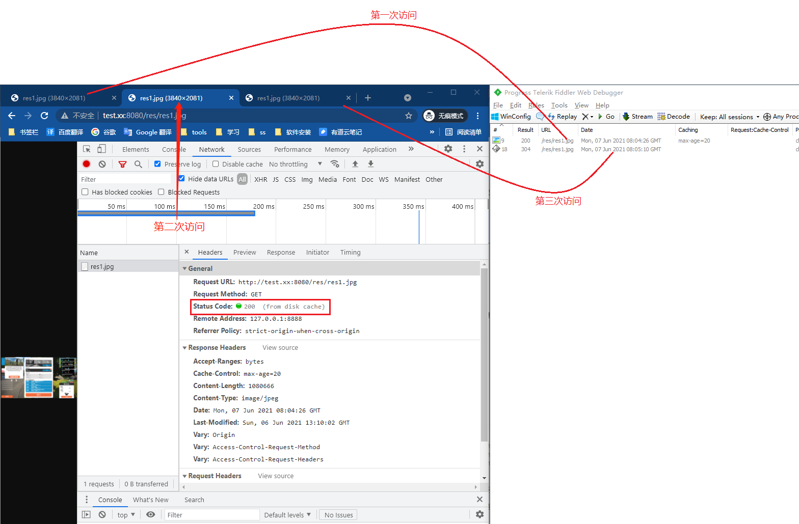

# 浏览器缓存的机制

> 应用场景：很少改变的数据（一般为静态资源）

[外链：浏览器缓存机制](https://blog.csdn.net/eroswang/article/details/8302191) [点击查看快照](./images/browser-cache.png)

**补充：**

## 关于cache-control的max-age说明

> [服务端源码](../spring-boot/spring-boot-demo/static-resources-personalized)

作用：max-age 大于 0 时代表通知客户端缓存资源多长时间（单位：秒）。

### 首次访问资源的两种方式

1. 浏览器输入url访问资源(本次实验中静态资源为：res1.jpg)
2. html中img、script等标签引入资源（本次实验中html为：test_cache.html，其中引入的资源为：res1.jpg）

### 再次访问资源的3种方式

1. 新开标签输入url访问资源
2. 普通属性（F5或者点击刷新按钮）
3. 强制刷新（Ctrl+F5） 

**由于不同浏览器中对于不同的再次访问资源缓存效果不一样，此处实测谷歌浏览器**

### 谷歌浏览器实测效果

> 浏览器版本：91.0.4472.77

**以下实验均会请求三次：**

1. 第一次请求：首次加载资源让浏览器完成缓存
2. 第二次请求：在有效缓存时间（20秒）内请求，以验证缓存是否生效
3. 第三次请求：在超出缓存时间后请求，以验证缓存是否失效

#### 实验开始

1. **首次访问：浏览器输入url访问资源**

	1. 再次访问：新开标签输入url访问资源

		结合fiddler查看控制台网络请求

		

		通过fiddler可以看出浏览器第二次访问未发生网络请求，那么缓存生效；浏览器第三次访问发生网络请求，那么缓存失效；

	2. 普通属性（F5或者点击刷新按钮）

		通过fiddler查看请求：

		

		三次访问均发生了请求则缓存未生效，这种情况下缓存不起作用。

	 3. 再次访问：强制刷新（Ctrl+F5）

		肯定不会命中缓存因为强制刷新会清空缓存。

2. **首次访问：html中引入资源**

	1. 再次访问：新开标签输入url访问资源

		结合fiddler查看控制台网络请求

		

		通过fiddler可以看出浏览器第二次访问未发生网络请求，那么缓存生效；浏览器第三次访问发生网络请求，那么缓存失效；

	2. **再次访问：普通属性（F5或者点击刷新按钮）**

		通过控制台查看网络请求

		

		第二次请求缓存生效，第三次请求缓存失效。这是cache-control的**正确使用姿势**。

	 3. 再次访问：强制刷新（Ctrl+F5）

		肯定不会命中缓存因为强制刷新会清空缓存。

#### 总结

| -        |   输入url访问资源    |       html中引入资源        |
| :------- | :------------------: | :-------------------------: |
| 新开标签 |     max-age生效      |         max-age生效         |
| 普通刷新 |     max-age无效      | max-age生效（**正确姿势**） |
| 强制刷新 | 该操作会导致清空缓存 |    该操作会导致清空缓存     |

